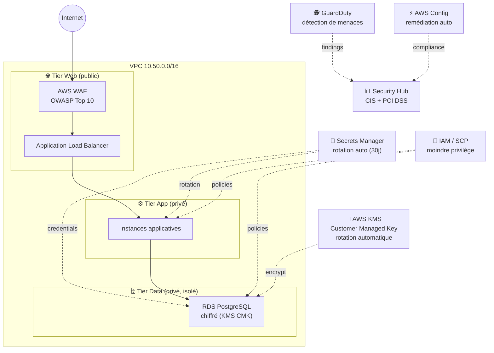

# 🛡️ Architecture Sécurisée Multi-Tier — Defense in Depth (AWS)

[](https://www.terraform.io/)
[](https://aws.amazon.com/)
[]()
[]()

## 🎯 Objectif du projet

Concevoir une architecture **3 tiers (web / app / data)** appliquant le principe de
**défense en profondeur** : chiffrement systématique, gestion centralisée des secrets,
détection de menaces, conformité continue (CIS, PCI DSS) et remédiation automatique.
Ce projet couvre le pilier **Sécurité** du AWS Well-Architected Framework.

## 🏗️ Architecture



### Composants clés

| Composant | Rôle |
|---|---|
| **AWS KMS (CMK)** | Clé gérée par le client, rotation automatique, chiffrement RDS/S3/EBS |
| **Secrets Manager** | Stockage et **rotation automatique** des identifiants RDS (Lambda de rotation) |
| **Amazon GuardDuty** | Détection continue de menaces (reconnaissance, malware, comportements anormaux) |
| **AWS Security Hub** | Agrégation des findings, scoring de conformité **CIS** et **PCI DSS** |
| **AWS Config** | Détection + **remédiation automatique** des ressources non conformes |
| **AWS WAF** | Protection du tier web contre les attaques OWASP Top 10 |
| **IAM / SCP** | Politiques de moindre privilège, garde-fous au niveau organisation |

## 📁 Structure du dépôt

```
.
├── terraform/
│   ├── versions.tf
│   ├── variables.tf
│   ├── main.tf          # VPC 3-tiers, KMS, Secrets Manager, GuardDuty, Security Hub, Config, WAF, IAM
│   └── outputs.tf
├── docs/
│   └── threat-model.md  # Modèle de menaces et mesures associées
└── README.md
```

## 🚀 Déploiement

```bash
git clone https://github.com/BakirAhmed/secure-multi-tier-defense-in-depth.git
cd secure-multi-tier-defense-in-depth/terraform

terraform init
terraform plan -out=tfplan
terraform apply tfplan
```

> ⚠️ GuardDuty et Security Hub sont facturés à l'usage. Faites `terraform destroy`
> après démonstration/capture d'écran.

## 🧠 Points techniques abordés

- Segmentation réseau **3 tiers** avec Security Groups en cascade (web → app → data)
- Chiffrement **at-rest** (KMS CMK) et **in-transit** (TLS/WAF en amont)
- Rotation automatique des secrets RDS via Lambda + Secrets Manager
- Agrégation de findings de sécurité multi-services dans **Security Hub**
- Conformité continue avec les référentiels **CIS AWS Foundations** et **PCI DSS**
- Remédiation automatisée avec **AWS Config Rules**
- Politiques IAM de moindre privilège (exemple : refus d'upload S3 non chiffré)

## 📸 Preuves de déploiement

*(Ajoutez ici des captures d'écran de la console : Security Hub score de conformité,
GuardDuty findings, RDS chiffré, WAF metrics — pour donner des preuves visuelles
concrètes du projet réalisé.)*

## 🔮 Améliorations futures

- [ ] Ajouter Service Control Policies (SCP) au niveau AWS Organizations
- [ ] Automatiser la remédiation via EventBridge + Lambda (findings Security Hub)
- [ ] Ajouter AWS Shield Advanced pour la protection DDoS
- [ ] Écrire des tests de conformité avec `checkov` ou `tfsec` en CI

## 👤 Auteur

**Ahmed Bakir** — Étudiant Ingénieur Réseaux & Cloud (EPSI Lyon / ENIG)
[LinkedIn](https://linkedin.com/in/ahmed-bk) · [GitHub](https://github.com/BakirAhmed)
